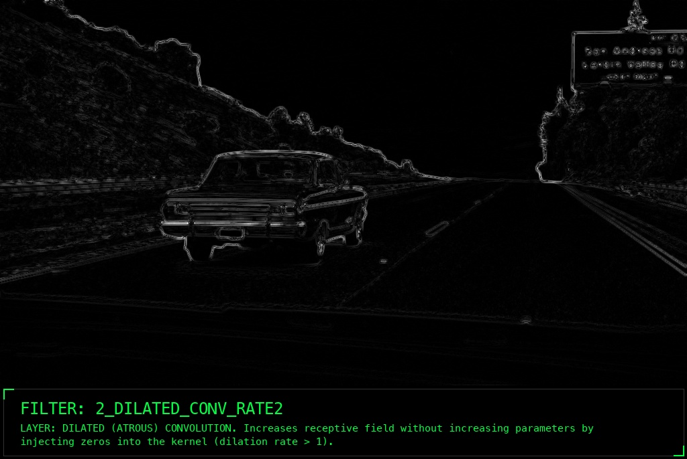
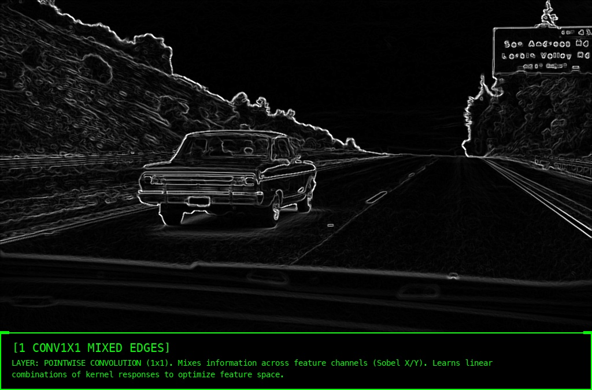
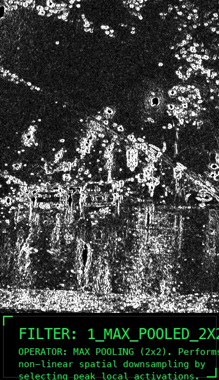
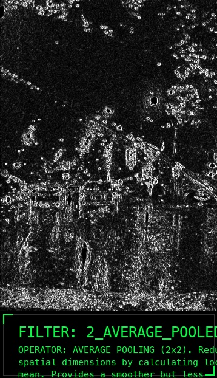
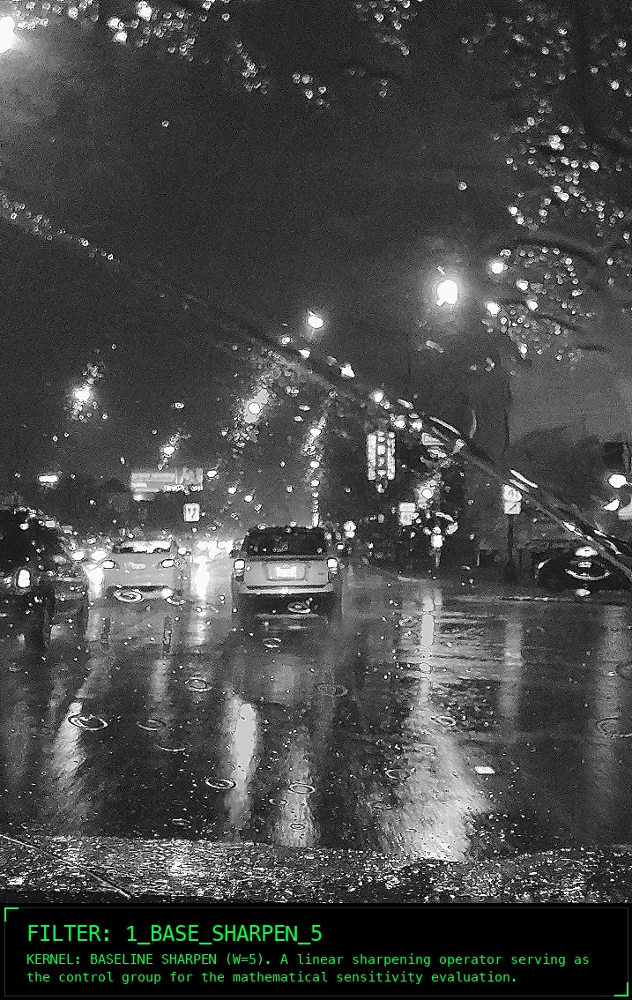

# 👁️ Convolutional Kernels & Neural Topology
### *A Mathematical and Empirical Deconstruction of Computer Vision*

*An in-depth analysis of linear and non-linear spatial filters, transitioning from classical mathematical feature extraction to advanced architectural neural layers.*

---

## 📌 Project Overview
This project serves as a comprehensive empirical study of convolutional filters and their role in feature extraction, noise reduction, and structural topology. Conducted using **OpenCV**, the pipeline systematically evaluates linear and non-linear operators, transitioning from classical mathematical kernels to advanced architectural layers (CNNs).

### 📊 Dataset Characteristics (Tasks 1, 3, 4)
To stress-test the kernels, two distinct images were processed. Upon loading, image dimensions and channel configurations were logged, and tensors were reduced to single-channel (grayscale) to isolate structural luminance:
1. **High-Contrast Image (Clear Highway):** Features strong geometric primitives (lane markers, horizon) and a uniform background.
2. **Low-Contrast & Noisy Image (Rainy City):** Features complex, clustered details obscured by extreme high-frequency noise (rain streaks).

---

## 🔬 Block 1: Feature Extraction (Edge Detection)
*Evaluating discrete derivative convolutions. To demonstrate environmental robustness, raw Edge Detection on the Clear Highway is compared against Edge Detection applied to the Rainy City (after noise-removal pipeline).*

| Filter Type | High Contrast (Clear Highway) | Low Contrast (Restored Rainy City) |
| :--- | :---: | :---: |
| **Sobel X** *(Horizontal Gradient)* |  |  |
| **Prewitt X** *(Harsher Edge Map)* |  |  |
| **Roberts** *(Diagonal Cross)* |  |  |

> **💡 Engineering Conclusion:** > * **Clear Highway:** Linear derivative filters (Sobel, Prewitt) efficiently extract structural boundaries. Roberts excels at pinpointing high-contrast intersections.
> * **Rainy City:** Raw derivatives fail completely on noisy data (amplifying rain). However, by applying them *after* a smoothing pipeline, we successfully extract the underlying geometry of the vehicles.

---

## 🔬 Block 2: Smoothing & Blurring (Noise Reduction)
*Analyzing linear vs. non-linear spatial filters to process the highly noisy Rainy City tensor.*

| Kernel Operation | Result on Noisy Image (Rainy City) | Analytical Commentary |
| :--- | :---: | :--- |
| **Mean Filter** *(Linear Average)* |  | Uniform averaging successfully dilutes rain noise, but aggressively blurs critical structural boundaries (car silhouettes). |
| **Gaussian Blur** *(Linear Weighted)* |  | Provides a more natural blur by weighting central pixels higher. However, it still fails to preserve sharp edges due to its linear interpolation. |
| **Median Filter** *(Non-Linear)* |  | **🏆 Optimal Approach.** Rank-order statistics effectively eradicate "salt-and-pepper" high-frequency rain noise while perfectly maintaining hard geometric boundaries. |

---

## 🔬 Block 3: Sharpening (Detail Recovery)
*Applying Unsharp Masking to recover frequencies lost during the smoothing phase.*

  

> **💡 Engineering Conclusion:** By subtracting a blurred version of the image from the original (Unsharp Masking), we successfully enhance the high-frequency components of the cars. This non-linear restoration is critical for preparing data for deeper network layers.

---

## 🔬 Block 4: Specialized Filters (Texture & Advanced CNNs)
*Evaluating domain-specific kernels and modern architectural convolution techniques.*

### 1. Gabor Filter Bank (Texture & Frequency Analysis)
| High Contrast (Highway) | Low Contrast (Rainy City) |
| :---: | :---: |
|  |  |

> **Conclusion:** The Gabor bank successfully isolates orientation-specific textures (e.g., asphalt grain), functioning similarly to the human visual cortex.

### 2. Architectural Kernels (Dilated & 1x1 Pointwise)

  
  

> **Conclusion:** **Dilated (Atrous) filters** expand the receptive field without increasing computational parameters, capturing broader context. **1x1 Convolutions** successfully mix depthwise feature maps (Sobel X and Y) into a compressed tensor, mimicking MobileNet efficiency.

---

## 🔬 Block 5: Spatial Reduction (Pooling)
*Simulating CNN dimensionality reduction on extracted feature maps.*

| Original Edges | Max Pooling (2x2) | Average Pooling (2x2) |
| :---: | :---: | :---: |
|  |  |  |

> **💡 Engineering Conclusion:** **Max Pooling** (non-linear) is vastly superior for feature retention, preserving peak edge activations while compressing spatial dimensions. **Average Pooling** (linear) dilutes the signal, resulting in a washed-out feature map.

---

## 🔬 Block 6: Metrics & Sensitivity Analysis
*Evaluating filter stability by shifting a central kernel parameter by $\pm 1$ ($W_{center}=5 \rightarrow W_{center}=6$).*

| Base Kernel (Center Weight = 5) | Shifted Kernel (Center Weight = 6) |
| :---: | :---: |
|  |  |

  <b>Visualizing the Difference (SAD Map)</b> 
  

### 📊 Metric Evaluation: Sum of Absolute Differences (SAD)
To quantify the impact of parameter shifting, the pixel-wise difference was calculated:
$$SAD = \sum_{i,j} |I_{Base}(i,j) - I_{Shifted}(i,j)|$$

> **💡 Final Conclusion on Parameter Efficiency:**
> The SAD metric quantifies a massive pixel-wise divergence caused by a minor $+1$ shift in a $3\times 3$ Sharpening matrix. 
> 1. Linear high-frequency filters are **highly unstable**; minor manual parameter adjustments cause explosive variance in the output signal.
> 2. **Project Thesis:** This sensitivity proves why manual crafting of convolutional kernels (Classical CV) is insufficient for complex environments. It validates the necessity of Automated Gradient Descent (Deep Learning) as the only reliable method to discover stable, generalized architectural weights.

---

## 👩‍💻 About the Author
**Dariia Zhdanova** *Computer Vision & Machine Learning Engineer*

📫 **Connect:** [LinkedIn](https://www.linkedin.com/in/dariia-z-b7146223a) | [GitHub](https://github.com/Dalliya)
